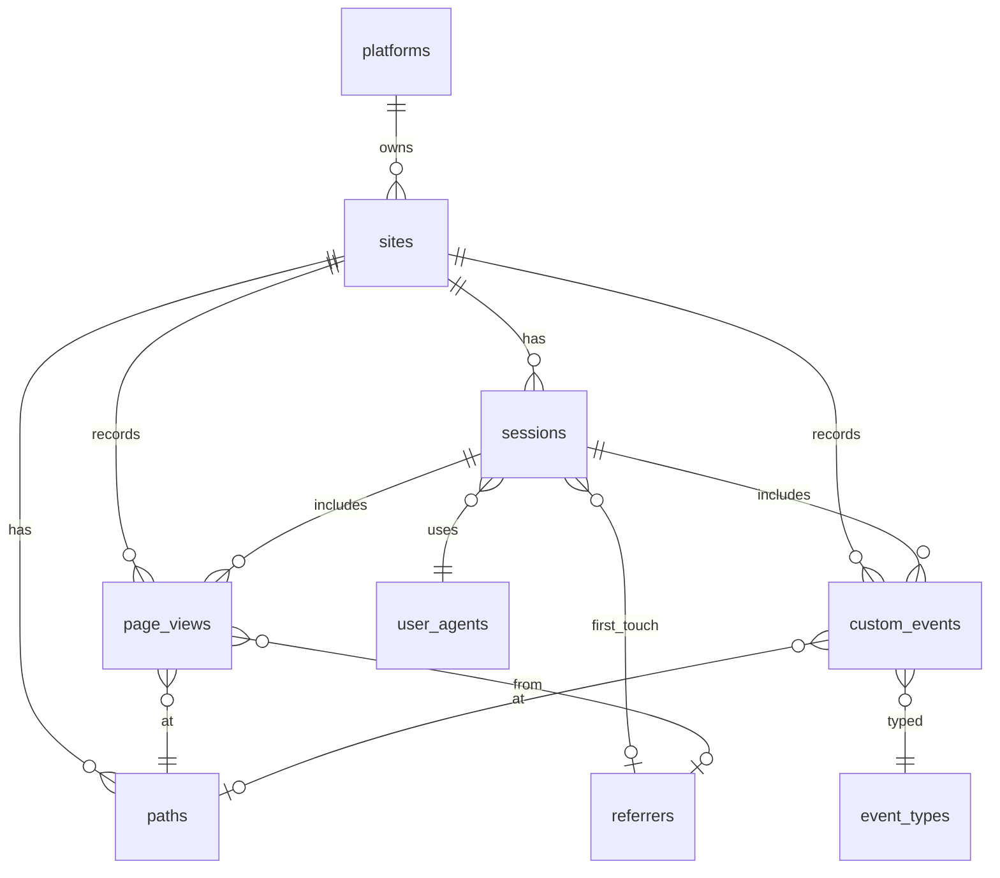

# Analytics schema — design and normalization (3NF minimum)

Living design doc for **PostgreSQL + PostgREST** multisite analytics on the Panax droplet.  
**Gate:** schema migrations (`002`–`008`) land only after this doc is approved.

## Goals

| Goal | Approach |
|------|----------|
| Multisite + future sites | Shared tables; `site_id` FK on every fact row |
| Platform owner Panax | `platforms` table; `sites.platform_id` FK → `panax` |
| Maximum capture | Atomic columns for all common dimensions; versioned `extras` JSONB only for rare extensions |
| PostgREST-only ingest | `SECURITY DEFINER` RPCs; no separate Node ingest service |
| Normalization floor | **Minimum 3NF** on all tables; BCNF where cheap (lookup tables) |
| DNS | **Hold** until stack tested; API via `curl --resolve` / `Host` header |

## Why not one table per site

Physical tables per site (`powerlift_page_views`, …) duplicate DDL, migrations, and PostgREST grants for every new domain.  
We use **one normalized schema** and **per-site SQL views** for API clarity (e.g. `powerlift_page_views` → `WHERE site_id = 'powerlift'`).

## Why not `meta JSONB` as the primary store

The bootstrap `001_init.sql` `events.meta` column is **legacy**. Storing path, referrer, UA, UTM, timing, and geo inside JSONB:

- Violates **1NF** (non-atomic “values” inside one cell for querying)
- Prevents indexes and constraints on important fields
- Breaks consistent reporting across sites

`extras JSONB` is allowed only for **rare, versioned** extensions (`extras_schema_version` on the row or session).

---

## Entity-relationship overview

---

## Tables

### `platforms`

Platform owner (Panax). Product domains stay separate; analytics rows use `site_id`.

| Column | Type | Notes |
|--------|------|-------|
| `id` | `TEXT` PK | `panax` |
| `slug` | `TEXT` UNIQUE NOT NULL | URL-safe identifier |
| `display_name` | `TEXT` NOT NULL | Human label |
| `created_at` | `TIMESTAMPTZ` NOT NULL DEFAULT `now()` |

**Seed:** one row `panax`.

### `sites`

Tenant registry — one row per `.ing` (and future domains).

| Column | Type | Notes |
|--------|------|-------|
| `id` | `TEXT` PK | `powerlift`, `powerbuild`, … |
| `platform_id` | `TEXT` NOT NULL FK → `platforms(id)` | Panax platform |
| `domain` | `TEXT` UNIQUE NOT NULL | `powerlift.ing` |
| `display_name` | `TEXT` NOT NULL | |
| `is_active` | `BOOLEAN` NOT NULL DEFAULT `true` | Soft-disable ingest |
| `created_at` | `TIMESTAMPTZ` NOT NULL DEFAULT `now()` |

**Adding site #6:** `INSERT INTO sites (...)` only — no new physical tables.

### `user_agents`

Deduped raw user-agent strings; parsed fields stored once.

| Column | Type | Notes |
|--------|------|-------|
| `id` | `BIGSERIAL` PK | |
| `ua_hash` | `BYTEA` UNIQUE NOT NULL | SHA-256 of normalized UA |
| `ua_raw` | `TEXT` NOT NULL | Original string |
| `browser_family` | `TEXT` | Parsed |
| `os_family` | `TEXT` | Parsed |
| `device_class` | `TEXT` | `desktop`, `mobile`, `tablet`, `bot`, … |
| `created_at` | `TIMESTAMPTZ` NOT NULL DEFAULT `now()` |

### `referrers`

Deduped referrer URLs (or empty for direct).

| Column | Type | Notes |
|--------|------|-------|
| `id` | `BIGSERIAL` PK | |
| `referrer_hash` | `BYTEA` UNIQUE NOT NULL | Hash of normalized referrer |
| `referrer_url` | `TEXT` | Full referrer when present |
| `referrer_host` | `TEXT` | eTLD+1 or host for grouping |
| `created_at` | `TIMESTAMPTZ` NOT NULL DEFAULT `now()` |

### `paths`

Normalized path per site (avoids repeating long path strings on every page view).

| Column | Type | Notes |
|--------|------|-------|
| `id` | `BIGSERIAL` PK | |
| `site_id` | `TEXT` NOT NULL FK → `sites(id)` | |
| `path_norm` | `TEXT` NOT NULL | Pathname only, normalized (leading `/`, no trailing junk) |
| `created_at` | `TIMESTAMPTZ` NOT NULL DEFAULT `now()` | |

**UNIQUE** `(site_id, path_norm)`.

### `event_types`

Lookup for custom (non-pageview) events.

| Column | Type | Notes |
|--------|------|-------|
| `id` | `SMALLSERIAL` PK | |
| `name` | `TEXT` UNIQUE NOT NULL | e.g. `program_card_open`, `open_in_builder` |
| `description` | `TEXT` | |
| `created_at` | `TIMESTAMPTZ` NOT NULL DEFAULT `now()` |

### `sessions`

Visit boundary — ties page views and custom events.

| Column | Type | Notes |
|--------|------|-------|
| `id` | `UUID` PK DEFAULT `gen_random_uuid()` | Returned to client |
| `site_id` | `TEXT` NOT NULL FK → `sites(id)` | |
| `visitor_id` | `UUID` NOT NULL | Anonymous visitor (cookie); stable across sessions |
| `user_agent_id` | `BIGINT` NOT NULL FK → `user_agents(id)` | |
| `first_referrer_id` | `BIGINT` FK → `referrers(id)` | First-touch referrer |
| `utm_source` | `TEXT` | First-touch; nullable |
| `utm_medium` | `TEXT` | |
| `utm_campaign` | `TEXT` | |
| `utm_term` | `TEXT` | |
| `utm_content` | `TEXT` | |
| `entry_path_id` | `BIGINT` FK → `paths(id)` | First page in session |
| `ip_hash` | `BYTEA` | SHA-256 of IP + daily salt (privacy) |
| `country_code` | `CHAR(2)` | Coarse geo when available |
| `region` | `TEXT` | |
| `city` | `TEXT` | |
| `timezone` | `TEXT` | Client IANA tz |
| `language` | `TEXT` | `navigator.language` |
| `started_at` | `TIMESTAMPTZ` NOT NULL DEFAULT `now()` | |
| `last_seen_at` | `TIMESTAMPTZ` NOT NULL DEFAULT `now()` | Updated on each hit |
| `extras` | `JSONB` NOT NULL DEFAULT `'{}'` | Versioned rare fields only |
| `extras_schema_version` | `SMALLINT` NOT NULL DEFAULT `1` | |

### `page_views`

**Core fact:** one row per page load (and optional unload beacon for duration/scroll).

| Column | Type | Notes |
|--------|------|-------|
| `id` | `BIGSERIAL` PK | |
| `site_id` | `TEXT` NOT NULL FK → `sites(id)` | |
| `session_id` | `UUID` NOT NULL FK → `sessions(id)` | |
| `path_id` | `BIGINT` NOT NULL FK → `paths(id)` | Where |
| `referrer_id` | `BIGINT` FK → `referrers(id)` | This hit’s referrer |
| `occurred_at` | `TIMESTAMPTZ` NOT NULL | Client time (trusted within skew window) |
| `recorded_at` | `TIMESTAMPTZ` NOT NULL DEFAULT `now()` | Server time |
| `full_url` | `TEXT` | Path + query if sent |
| `query_string` | `TEXT` | Optional split for reporting |
| `document_title` | `TEXT` | |
| `is_entry` | `BOOLEAN` NOT NULL DEFAULT `false` | First page in session |
| `is_exit` | `BOOLEAN` NOT NULL DEFAULT `false` | Unload beacon |
| `viewport_w` | `SMALLINT` | |
| `viewport_h` | `SMALLINT` | |
| `screen_w` | `SMALLINT` | |
| `screen_h` | `SMALLINT` | |
| `device_pixel_ratio` | `REAL` | |
| `connection_type` | `TEXT` | Network Information API when available |
| `load_time_ms` | `INTEGER` | Navigation timing |
| `dom_ready_ms` | `INTEGER` | |
| `duration_ms` | `INTEGER` | Time on page (unload) |
| `scroll_depth_pct` | `SMALLINT` | 0–100 |
| `extras` | `JSONB` NOT NULL DEFAULT `'{}'` | |
| `extras_schema_version` | `SMALLINT` NOT NULL DEFAULT `1` | |

**Indexes (planned):** `(site_id, occurred_at DESC)`, `(session_id, occurred_at)`, `(path_id, occurred_at)`.

### `custom_events`

Product events (builder, programs grid, share, etc.).

| Column | Type | Notes |
|--------|------|-------|
| `id` | `BIGSERIAL` PK | |
| `site_id` | `TEXT` NOT NULL FK → `sites(id)` | |
| `session_id` | `UUID` NOT NULL FK → `sessions(id)` | |
| `event_type_id` | `SMALLINT` NOT NULL FK → `event_types(id)` | |
| `path_id` | `BIGINT` FK → `paths(id)` | Context page |
| `occurred_at` | `TIMESTAMPTZ` NOT NULL | |
| `recorded_at` | `TIMESTAMPTZ` NOT NULL DEFAULT `now()` | |
| `template_id` | `TEXT` | e.g. programs template slug |
| `label` | `TEXT` | Optional human label |
| `value_num` | `DOUBLE PRECISION` | Optional metric |
| `extras` | `JSONB` NOT NULL DEFAULT `'{}'` | |
| `extras_schema_version` | `SMALLINT` NOT NULL DEFAULT `1` | |

---

## Normalization proof (minimum 3NF)

**Definitions (short):**

- **1NF:** atomic columns; no repeating groups; no multi-valued cells used for core reporting.
- **2NF:** no non-key attribute depends on part of a composite key (all tables use single surrogate PK except uniqueness constraints).
- **3NF:** no non-key attribute depends on another non-key attribute (no transitive dependencies).

**BCNF (stretch):** every determinant is a candidate key — satisfied for `paths (site_id, path_norm)`, `user_agents (ua_hash)`, `referrers (referrer_hash)`, `event_types (name)`.

### Per-table checklist

| Table | PK | 1NF | 2NF | 3NF | Notes |
|-------|-----|-----|-----|-----|-------|
| `platforms` | `id` | ✓ | ✓ | ✓ | Only platform attributes on platform row |
| `sites` | `id` | ✓ | ✓ | ✓ | `domain` → `sites.id`, not duplicated on facts |
| `user_agents` | `id` | ✓ | ✓ | ✓ | `browser_family` depends on `ua_hash` / `id`, not on `page_views` |
| `referrers` | `id` | ✓ | ✓ | ✓ | Referrer strings not repeated on every hit |
| `paths` | `id` | ✓ | ✓ | ✓ | BCNF on `(site_id, path_norm)` |
| `event_types` | `id` | ✓ | ✓ | ✓ | Event name not duplicated as free text on every row |
| `sessions` | `id` | ✓ | ✓ | ✓ | UA via `user_agent_id`; first-touch UTM on session, not copied to every `page_views` row |
| `page_views` | `id` | ✓ | ✓ | ✓ | “Where” = `path_id`; “when” = `occurred_at`; no derived UA/browser column |
| `custom_events` | `id` | ✓ | ✓ | ✓ | Type via `event_type_id`; optional `template_id` is event-specific, not derived from path |

### Transitive dependencies explicitly avoided

| Bad (denormalized) | Correct (3NF) |
|--------------------|---------------|
| `page_views.browser_family` | `page_views` → `sessions` → `user_agents.browser_family` |
| `page_views.referrer_url` repeated string | `referrer_id` → `referrers.referrer_url` |
| `page_views.path` repeated string | `path_id` → `paths.path_norm` |
| `page_views.site_domain` | `site_id` → `sites.domain` |
| All dimensions in `meta JSONB` | Atomic columns + `extras` only for extensions |

### `extras JSONB`

- Does **not** hold fields that are required for core reporting (paths, timing, UTM, device).
- **1NF:** one JSON document per row is acceptable as a single optional extension cell (industry-standard escape hatch).
- Document allowed keys per `extras_schema_version` in `docs/ANALYTICS-EXTRAS.md` (future, when used).

### Future efficiency

Maintaining **3NF** keeps a clean logical model. Denormalized read models (materialized views, columnar export, warehouse) can be added later without corrupting the write path. Improved normalization or compression tooling in the future operates on a sound base.

---

## PostgREST API (planned)

| RPC | Purpose |
|-----|---------|
| `start_session(...)` | Create session; return `session_id` + `visitor_id` |
| `record_page_view(...)` | Insert path (upsert), page_view row; bump `sessions.last_seen_at`. **`p_occurred_at` required** (maps to NOT NULL `page_views.occurred_at`). |
| `record_custom_event(...)` | Insert custom event. **`p_occurred_at` required** (maps to NOT NULL `custom_events.occurred_at`). |

- Roles: `authenticator` → `web_anon` (ingest only).
- Admin/read role (later): separate role; not `web_anon`.
- Per-site views: `powerlift_page_views`, … for read-only dashboards.

Legacy `collect_event` in `001_init.sql` will be superseded and dropped after RPC cutover.

---

## Privacy and retention

| Data | Treatment |
|------|-----------|
| IP | Store `ip_hash` only (salt rotated daily on server) |
| Visitor | Random `visitor_id` UUID in cookie |
| Geo | Coarse `country_code` / region / city when derived server-side |
| Retention | Policy TBD; partition `page_views` by month when volume warrants |

Update site privacy policies before enabling front-end beacon.

---

## Migration sequence (Track B — after this doc)

| File | Content |
|------|---------|
| `002_platforms.sql` | `platforms`; alter `sites` |
| `003_dimensions.sql` | `user_agents`, `referrers`, `paths`, `event_types` |
| `004_page_views.sql` | `sessions`, `page_views` |
| `005_custom_events.sql` | `custom_events` |
| `006_postgrest_api.sql` | roles, `start_session`, `record_page_view` |
| `007_postgrest_rpcs.sql` | `record_custom_event` |
| `008_site_views.sql` | per-site views |
| `009_drop_legacy_events.sql` | drop `events` + `collect_event` (after smoke test) |

---

## Related docs

- [DATABASE.md](DATABASE.md) — Postgres vs SQLite decision
- [ANALYTICS.md](ANALYTICS.md) — stack summary
- [DNS.md](DNS.md) — pre-DNS API testing

**Approved for implementation:** 3NF minimum accepted; proceed to Track A2/A3 docs, then Track B migrations.
